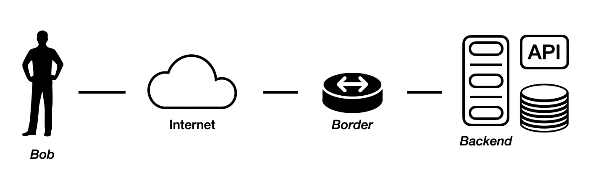

# Hyperscale: from 1 to 1 billion clients

## Structure

Should these be questions? As if I answer what would one learn ? 
Also these should be links

* Client-server, single host - single point of failure
* Client-server, triumvirate
* Hierarchy of devices
* L3-L4-L7
* Client on a diffrent continent
* Backbone network
* DNS Global load balancing
* State-of-the-Art - 7 stages of LB
* Load balancing static data
* Degressions

## Here we go

Imo, it's not enough to learn the *state-of-the-art* of modern load balancing to
be a good engineer and work with traffic. The system is everchanging and one
must understand the reasoning and logic behind every part of the system in order
to make the right decisions.

### Client-server

We'll start slowly. Imaging building a revolutionary meme-hosting service. No
cloud providers, no serverless, no all-in-one solutions just you, a server and
your clients. Besides that you have a domain, public IP and a simple router.

